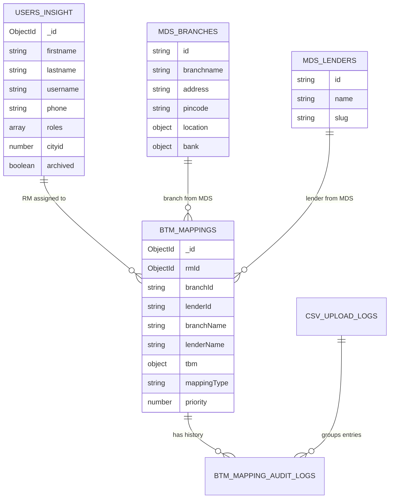
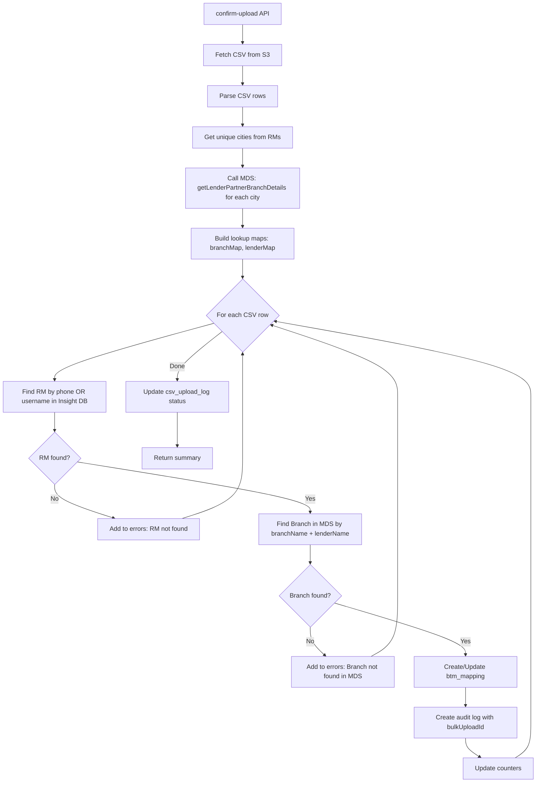

# BTM Mapping Database Design (Updated with MDS Integration)

## Architecture Overview

```
┌─────────────────────────────────────────────────────────────────────────────┐
│                            DATA SOURCES                                      │
├─────────────────────────────────────────────────────────────────────────────┤
│                                                                              │
│  ┌──────────────────────┐    ┌──────────────────────────────────────────┐   │
│  │   INSIGHT DB         │    │          MDS SERVICES                    │   │
│  │   (MongoDB)          │    │   (External APIs via rupeek.js)          │   │
│  │                      │    │                                          │   │
│  │  • users (RMs)       │    │  • getLenderPartnerBranchDetails()       │   │
│  │  • btm_mappings      │    │    → Lender info (bank.id, bank.name)    │   │
│  │  • btm_mapping_      │    │    → Branch info (id, branchname)        │   │
│  │    audit_logs        │    │                                          │   │
│  │  • csv_upload_logs   │    │  • fetchLenderDetails() / V2             │   │
│  │  • branch_tbm_info   │    │    → Lender details with slug            │   │
│  │    (NEW - local)     │    │                                          │   │
│  └──────────────────────┘    └──────────────────────────────────────────┘   │
│                                                                              │
└─────────────────────────────────────────────────────────────────────────────┘
```

---

## CSV Template (Fixed - Do Not Change)

| Column | Description | Source | Lookup Key |
|--------|-------------|--------|------------|
| Lender | Bank/Lender name | MDS | Match with `bank.name` |
| Branch Name | Branch name | MDS | For reference |
| Sol ID | Branch identifier | MDS | Match with `branch.id` |
| RM Name | Relationship Manager name | Insight DB | For reference |
| Employee ID | RM's employee ID | Insight DB | Match with `user.username` |
| Email ID | RM's email | Insight DB | For reference |
| Phone number | RM's phone | Insight DB | Match with `user.phone` |
| TBM Name | Territory Branch Manager | Insight DB | For reference |
| TBM Employee ID | TBM's employee ID | Insight DB | Match with `user.username` (role: "TBM") |
| TBM Email ID | TBM's email | Insight DB | For reference |
| TBM Phone number | TBM's phone | Insight DB | Match with `user.phone` (role: "TBM") |
| Type of Mapping | e.g., "Fed 1", "SIB 2" | CSV Input | Stored in btm_mappings |

---

## MDS Service Integration

### Available MDS Functions (from `src/api/services/rupeek.js` and `masterdataservice.js`)

#### 1. `getLenderPartnerBranchDetails(city, token)` - Primary Source

**Location:** `src/api/services/rupeek.js`

**API Call:**
```
GET {CORE_URI}/api/v1/lender/partner/branch
  ?cityid={city}
Authorization: JWT {token}
```

**Response Structure:**
```javascript
{
  status: 200,
  branches: [
    {
      id: "branch-uuid-string",           // ← Use as branchId (Sol ID equivalent)
      branchname: "Federal - HSR",        // ← Branch Name
      location: {
        x: 12.9352,                       // latitude
        y: 77.6245                        // longitude
      },
      address: "123 Main St, HSR Layout",
      pincode: "560034",
      bank: {
        id: "lender-uuid-string",         // ← Use as lenderId
        name: "Federal Bank",             // ← Lender name
        slug: "federal-bank"              // ← Lender slug
      }
    },
    // ... more branches
  ]
}
```

**Caching:** Redis with key `lenderbranches:{city}`, TTL 1 hour

---

#### 2. `fetchLenderDetailsV2(lenderId)` - For Lender Slug

**Location:** `src/api/services/masterdataservice.js`

**API Call:**
```
GET {LENDING_MDS_URI}/api/v1/lendingPartners/{lenderId}
Authorization: Basic {LENDING_MDS_TOKEN}
```

**Response Structure:**
```javascript
{
  data: {
    id: "lender-uuid",
    slug: "federal-bank",
    name: "Federal Bank",
    // ... other lender properties
  }
}
```

**Caching:** Redis with key `{lenderId}lenderdetail`, TTL 4 hours

---

## Existing Schema (Reference)

### `users` Collection (Existing) - RMs have role "agent", TBMs have role "TBM"

```javascript
{
  _id: ObjectId,
  firstname: String,           // "Roshni"
  lastname: String,            // "Kumar"
  username: String,            // Employee ID - "RM1234" or "TBM001"
  phone: String,               // "9876543210" (10 digits)
  roles: ["agent"],            // RMs have "agent" role, TBMs have "TBM" role
  cityid: Number,              // City ID matching MDS
  archived: Boolean,           // false for active users
  picid: String,
  langpref: String,
  profile: ObjectId,
  capability: ObjectId,
  chakraAgentID: String,
  createdAt: Date,
  updatedAt: Date
}
```

**To find RMs:** `db.users.find({ roles: "agent", archived: false })`  
**To find TBMs:** `db.users.find({ roles: "TBM", archived: false })`

---

## New Collections

### 1. `btm_mappings` Collection (NEW)

Stores the mapping between RMs (from Insight DB) and Branches (from MDS).

```javascript
{
  _id: ObjectId,
  
  // RM Reference (from Insight DB - users collection)
  rmId: ObjectId,               // Reference to users collection (role: "agent")
  
  // Branch/Lender Reference (from MDS - stored as strings since MDS uses UUIDs)
  branchId: String,             // MDS branch.id (used as Sol ID)
  lenderId: String,             // MDS bank.id
  
  // Denormalized MDS data (cached for display, updated on CSV upload)
  branchName: String,           // MDS branch.branchname - "Federal - HSR"
  lenderName: String,           // MDS bank.name - "Federal Bank"
  lenderSlug: String,           // MDS bank.slug - "federal-bank"
  
  // City for filtering
  cityId: Number,               // City ID from user.cityid
  
  // TBM Reference (from Insight DB - users collection with role "TBM")
  tbmId: ObjectId,              // Reference to users collection (role: "TBM")
  
  // Mapping details
  mappingType: String,          // "Fed 1", "Fed 2", "SIB 1"
  priority: Number,             // 1 = Primary, 2 = Secondary
  
  // Audit fields
  createdBy: ObjectId,          // User who created this mapping
  updatedBy: ObjectId,          // User who last updated this mapping
  createdAt: Date,
  updatedAt: Date
}
```

#### Field Explanations - `btm_mappings`

| Field | Type | Required | Source | Purpose |
|-------|------|----------|--------|---------|
| `rmId` | ObjectId | Yes | Insight DB | Reference to the RM (user with role "agent") |
| `branchId` | String | Yes | MDS | MDS branch.id - unique identifier for branch |
| `lenderId` | String | Yes | MDS | MDS bank.id - unique identifier for lender |
| `branchName` | String | Yes | MDS (cached) | Denormalized for display without MDS call |
| `lenderName` | String | Yes | MDS (cached) | Denormalized for display without MDS call |
| `lenderSlug` | String | No | MDS (cached) | Used for generating mappingType prefix |
| `cityId` | Number | Yes | User's cityid | For filtering by city |
| `tbm.name` | String | No | CSV Upload | TBM name - stored locally |
| `tbm.employeeId` | String | No | CSV Upload | TBM employee ID |
| `tbm.email` | String | No | CSV Upload | TBM email |
| `tbm.phone` | String | No | CSV Upload | TBM phone (10 digits) |
| `mappingType` | String | Yes | CSV Upload | "Fed 1", "SIB 2" format |
| `priority` | Number | Yes | Derived | 1 or 2, extracted from mappingType |

#### Indexes - `btm_mappings`

| Index | Type | Purpose |
|-------|------|---------|
| `{ rmId: 1, branchId: 1 }` | Unique Compound | Prevents duplicate RM-Branch mappings |
| `{ rmId: 1, lenderId: 1, priority: 1 }` | Compound | RM View - find all mappings for an RM |
| `{ branchId: 1 }` | Single | Branch View - find all RMs for a branch |
| `{ lenderId: 1 }` | Single | Filter by lender |
| `{ cityId: 1 }` | Single | Filter by city |
| `{ tbmId: 1 }` | Single | Filter by TBM |

---

### 2. `btm_mapping_audit_logs` Collection (NEW)

Comprehensive audit trail for all mapping changes.

```javascript
{
  _id: ObjectId,
  
  // What was changed - IDs preserved for querying even after delete
  mappingId: ObjectId,          // Reference to btm_mappings (null after DELETE)
  rmId: ObjectId,               // Reference to users (preserved)
  branchId: String,             // MDS branch ID (preserved)
  lenderId: String,             // MDS lender ID (preserved)
  
  // What action was performed
  action: String,               // "CREATE", "UPDATE", "DELETE", "BULK_CREATE"
  
  // Complete mapping state BEFORE the action (null for CREATE/BULK_CREATE)
  previousValues: {
    // Full snapshot of btm_mappings document
  },
  
  // Complete mapping state AFTER the action (null for DELETE)
  newValues: {
    // Full snapshot of btm_mappings document
  },
  
  // Who made the change (denormalized for history)
  performedBy: {
    userId: ObjectId,
    userName: String,           // Preserved even if user deleted
    userEmail: String,
    userRole: String            // Role at time of action
  },
  
  // For bulk uploads - reference to upload batch
  bulkUploadId: ObjectId,       // Groups all entries from same CSV (null for single ops)
  
  // Optional notes
  remarks: String,
  
  // When
  performedAt: Date
}
```

#### Indexes - `btm_mapping_audit_logs`

| Index | Type | Purpose |
|-------|------|---------|
| `{ mappingId: 1, performedAt: -1 }` | Compound | Get history of specific mapping |
| `{ "performedBy.userId": 1, performedAt: -1 }` | Compound | Actions by a user |
| `{ rmId: 1, performedAt: -1 }` | Compound | Changes for an RM |
| `{ branchId: 1, performedAt: -1 }` | Compound | Changes for a branch |
| `{ action: 1, performedAt: -1 }` | Compound | Filter by action type |
| `{ bulkUploadId: 1 }` | Single | Group by CSV upload batch |
| `{ performedAt: -1 }` | Single Descending | Recent activity feed |

---

### 3. `csv_upload_logs` Collection (NEW)

Tracks metadata about each CSV upload operation.

```javascript
{
  _id: ObjectId,                // This is the bulkUploadId
  
  // File information
  fileName: String,             // "mapping_jan2025.csv"
  fileKey: String,              // S3 key: "btm-uploads/2025/01/uuid.csv"
  fileSize: Number,             // Size in bytes
  
  // Processing status
  status: String,               // "PENDING", "PROCESSING", "COMPLETED", "FAILED"
  
  // Processing results
  totalRows: Number,
  processedRows: Number,
  failedRows: Number,
  createdCount: Number,
  updatedCount: Number,
  skippedCount: Number,
  
  // Error details for failed rows
  errors: [{
    rowNumber: Number,
    rowData: Object,            // Raw CSV row data
    errorMessage: String        // Why it failed
  }],
  
  // Who uploaded
  uploadedBy: {
    userId: ObjectId,
    userName: String,
    userEmail: String
  },
  
  // Timestamps
  uploadedAt: Date,
  processingStartedAt: Date,
  processingCompletedAt: Date
}
```

---

## Entity Relationships with MDS



---

## CSV Processing Flow with MDS

### Step 1: Get Upload URL
```
POST /api/btm-mapping/get-upload-url
→ Returns S3 pre-signed URL
```

### Step 2: Upload CSV to S3
```
PUT {s3-presigned-url}
→ File uploaded to S3
```

### Step 3: Process CSV



---

## CSV Row Processing Logic

```javascript
// Step 1: Build MDS lookup maps (call once per city, cached)
const mdsCache = new Map(); // cityId -> { branches: Map, lenders: Map }

async function buildMDSCache(cities, token) {
  for (const cityId of cities) {
    const mdsResponse = await RupeekService.getLenderPartnerBranchDetails(cityId, token);
    
    if (mdsResponse && mdsResponse.status === 200) {
      const branchMap = new Map();
      const lenderMap = new Map();
      
      mdsResponse.branches.forEach(branch => {
        // Key: lowercase "lender|branchname" for matching
        const key = `${branch.bank.name.toLowerCase()}|${branch.branchname.toLowerCase()}`;
        branchMap.set(key, {
          id: branch.id,                    // Sol ID equivalent
          branchname: branch.branchname,
          address: branch.address,
          pincode: branch.pincode,
          location: branch.location
        });
        
        // Store lender info
        if (!lenderMap.has(branch.bank.id)) {
          lenderMap.set(branch.bank.id, {
            id: branch.bank.id,
            name: branch.bank.name,
            slug: branch.bank.slug
          });
        }
      });
      
      mdsCache.set(cityId, { branches: branchMap, lenders: lenderMap });
    }
  }
}

// Step 2: Process each CSV row
async function processRow(row, currentUser, bulkUploadId) {
  const errors = [];
  
  // Find RM by phone or username (Employee ID)
  const rm = await User.findOne({
    $or: [
      { phone: row['Phone number'] },
      { username: row['Employee ID'] }
    ],
    roles: 'agent',
    archived: false
  });
  
  if (!rm) {
    return { 
      error: `RM with phone '${row['Phone number']}' or Employee ID '${row['Employee ID']}' not found` 
    };
  }
  
  // Find TBM by phone or username (Employee ID) - optional
  let tbmId = null;
  if (row['TBM Employee ID'] || row['TBM Phone number']) {
    const tbm = await User.findOne({
      $or: [
        { phone: row['TBM Phone number'] },
        { username: row['TBM Employee ID'] }
      ],
      roles: 'TBM',
      archived: false
    });
    
    if (tbm) {
      tbmId = tbm._id;
    }
    // Note: TBM is optional, so we don't fail if not found
  }
  
  // Get MDS data for RM's city
  const cityData = mdsCache.get(rm.cityid);
  if (!cityData) {
    return { 
      error: `No MDS data available for city ID ${rm.cityid}` 
    };
  }
  
  // Find branch by lender name + branch name
  const branchKey = `${row['Lender'].toLowerCase()}|${row['Branch Name'].toLowerCase()}`;
  const branchData = cityData.branches.get(branchKey);
  
  if (!branchData) {
    return { 
      error: `Branch '${row['Branch Name']}' under lender '${row['Lender']}' not found in MDS` 
    };
  }
  
  // Find lender info
  let lenderData = null;
  for (const [id, lender] of cityData.lenders) {
    if (lender.name.toLowerCase() === row['Lender'].toLowerCase()) {
      lenderData = lender;
      break;
    }
  }
  
  if (!lenderData) {
    return { 
      error: `Lender '${row['Lender']}' not found in MDS` 
    };
  }
  
  // Extract priority from mapping type (e.g., "Fed 1" → 1)
  const priorityMatch = row['Type of Mapping'].match(/\d+$/);
  const priority = priorityMatch ? parseInt(priorityMatch[0]) : 1;
  
  // Create/Update mapping
  const mappingData = {
    rmId: rm._id,
    branchId: branchData.id,           // MDS branch ID (Sol ID)
    lenderId: lenderData.id,           // MDS lender ID
    branchName: branchData.branchname, // Cached for display
    lenderName: lenderData.name,       // Cached for display
    lenderSlug: lenderData.slug,       // Cached
    cityId: rm.cityid,
    tbmId: tbmId,                      // Reference to TBM user (if found)
    mappingType: row['Type of Mapping'],
    priority: priority,
    updatedBy: currentUser._id,
    updatedAt: new Date()
  };
  
  // Check if mapping exists
  const existingMapping = await BTMMapping.findOne({
    rmId: rm._id,
    branchId: branchData.id
  });
  
  if (existingMapping) {
    // UPDATE
    const previousValues = existingMapping.toObject();
    await BTMMapping.updateOne(
      { _id: existingMapping._id },
      { $set: mappingData }
    );
    
    return {
      action: 'UPDATE',
      mappingId: existingMapping._id,
      previousValues,
      newValues: { ...mappingData, _id: existingMapping._id }
    };
  } else {
    // CREATE
    mappingData.createdBy = currentUser._id;
    mappingData.createdAt = new Date();
    
    const newMapping = await BTMMapping.create(mappingData);
    
    return {
      action: 'BULK_CREATE',
      mappingId: newMapping._id,
      previousValues: null,
      newValues: newMapping.toObject()
    };
  }
    }
```

---

## API Endpoints with Request/Response Examples

### 1. `POST /api/btm-mapping/get-upload-url`

Get S3 pre-signed URL for CSV upload.

**Request:**
```json
{
  "fileName": "btm_mapping_jan2025.csv",
  "fileType": "text/csv"
}
```

**Response:**
```json
{
  "success": true,
  "data": {
    "uploadUrl": "https://s3.ap-south-1.amazonaws.com/...",
    "fileKey": "btm-uploads/2025/01/abc-def-123.csv",
    "expiresIn": 300
  }
}
```

---

### 2. `POST /api/btm-mapping/confirm-upload`

Process uploaded CSV - calls MDS for branch/lender validation.

**Request:**
```json
{
  "fileKey": "btm-uploads/2025/01/abc-def-123.csv"
}
```

**Response:**
```json
{
  "success": true,
  "data": {
    "uploadId": "679a1b2c3d4e5f6a7b8c9d0e",
    "fileName": "btm_mapping_jan2025.csv",
    "status": "COMPLETED",
    "summary": {
      "totalRows": 150,
      "processedRows": 148,
      "createdCount": 120,
      "updatedCount": 28,
      "failedRows": 2,
      "skippedCount": 0
    },
    "errors": [
      {
        "rowNumber": 45,
        "data": {
          "Lender": "Federal Bank",
          "Branch Name": "Unknown Branch",
          "RM Name": "Unknown Person"
        },
        "error": "Branch 'Unknown Branch' under lender 'Federal Bank' not found in MDS"
      },
      {
        "rowNumber": 89,
        "data": {
          "Lender": "SIB",
          "RM Name": "Ghost User",
          "Phone number": "1111111111"
        },
        "error": "RM with phone '1111111111' or Employee ID 'RMXXX' not found"
      }
    ],
    "processingTime": "1m 40s"
  }
}
```

---

### 3. `GET /api/btm-mapping/branches`

Get Branch View - calls MDS for fresh branch data, joins with local mappings.

**Query Parameters:**
| Parameter | Type | Description |
|-----------|------|-------------|
| city | number | Filter by city ID (required for MDS call) |
| lenderId | string | Filter by MDS lender ID |
| page | number | Page number (default: 1) |
| limit | number | Items per page (default: 50) |

**Implementation Logic:**
```javascript
async function getBranchesView(cityId, token, filters) {
  // 1. Get fresh data from MDS
  const mdsResponse = await RupeekService.getLenderPartnerBranchDetails(cityId, token);
  
  // 2. Get all mappings for this city
  const mappings = await BTMMapping.find({ cityId })
    .populate('rmId', 'firstname lastname username phone');
  
  // 3. Build response grouped by lender
  const result = groupByLender(mdsResponse.branches, mappings);
  
  return result;
}
```

**Response:**
```json
{
  "success": true,
  "data": [
    {
      "lenderId": "mds-lender-uuid-1",
      "lenderName": "Federal Bank",
      "lenderSlug": "federal-bank",
      "activeBranches": 134,
      "branches": [
        {
          "branchId": "mds-branch-uuid-1",
          "branchName": "Federal - HSR",
          "solId": "mds-branch-uuid-1",
          "city": "Bangalore",
          "address": "123 HSR Layout",
          "pincode": "560102",
          "tbmId": "507f1f77bcf86cd799439020",
          "tbmName": "John Doe",
          "tbmEmployeeId": "TBM001",
          "rmsMapped": 2,
          "hasManpower": true,
          "rms": [
            {
              "rmId": "507f1f77bcf86cd799439013",
              "rmName": "Roshni Kumar",
              "employeeId": "RM1234",
              "phone": "9876543210",
              "mappingType": "Fed 1",
              "priority": 1
            },
            {
              "rmId": "507f1f77bcf86cd799439014",
              "rmName": "Ajay Kumar",
              "employeeId": "RM4619",
              "phone": "9876543211",
              "mappingType": "Fed 2",
              "priority": 2
            }
          ]
        }
      ]
    }
  ],
  "pagination": {
    "page": 1,
    "limit": 20,
    "totalLenders": 5,
    "totalBranches": 134
  }
}
```

---

### 4. `GET /api/btm-mapping/rms`

Get RM View - RMs from Insight DB with their mappings.

**Query Parameters:**
| Parameter | Type | Description |
|-----------|------|-------------|
| city | number | Filter by city ID |
| lenderId | string | Filter RMs mapped to specific lender |
| hasMapping | boolean | true = only mapped RMs |
| page | number | Page number |
| limit | number | Items per page |

**Response:**
```json
{
  "success": true,
  "data": [
    {
      "cityId": 1,
      "city": "Bangalore",
      "activeRMs": 23,
      "rms": [
        {
          "rmId": "507f1f77bcf86cd799439013",
          "rmName": "Roshni Kumar",
          "employeeId": "RM1234",
          "phone": "9876543210",
          "email": "roshni@example.com",
          "totalMappings": 3,
          "mappings": [
            {
              "mappingId": "507f1f77bcf86cd799439100",
              "lenderId": "mds-lender-uuid-1",
              "lenderName": "Federal Bank",
              "branchId": "mds-branch-uuid-1",
              "branchName": "Federal - HSR",
              "solId": "mds-branch-uuid-1",
              "mappingType": "Fed 1",
              "priority": 1,
              "tbmId": "507f1f77bcf86cd799439020",
              "tbmName": "John Doe",
              "tbmEmployeeId": "TBM001"
            }
          ]
        }
      ]
    }
  ],
  "pagination": {
    "page": 1,
    "limit": 50,
    "totalCities": 5,
    "totalRMs": 156
  }
}
```

---

### 5. `GET /api/btm-mapping/download`

Download current mapping data as CSV - matches the upload template format.

**Response Headers:**
```
Content-Type: text/csv
Content-Disposition: attachment; filename=btm_mapping_2025-01-26.csv
```

**Response Body (CSV):**
```csv
Lender,Branch Name,Sol ID,RM Name,Employee ID,Email ID,Phone number,TBM Name,TBM Employee ID,TBM Email ID,TBM Phone number,Type of Mapping
Federal Bank,Federal - HSR,mds-branch-uuid-1,Roshni Kumar,RM1234,roshni@example.com,9876543210,John Doe,TBM001,john@example.com,9999999999,Fed 1
Federal Bank,Federal - HSR,mds-branch-uuid-1,Ajay Kumar,RM4619,ajay@example.com,9876543211,John Doe,TBM001,john@example.com,9999999999,Fed 2
SIB,SIB - Whitefield,mds-branch-uuid-5,Vikram Rao,RM7890,vikram@example.com,9876543213,Anil Kumar,TBM003,anil@example.com,7777777777,SIB 1
```

**Implementation:**
```javascript
async function downloadMappings(filters, res) {
  // Get all mappings with populated RM data
  const mappings = await BTMMapping.find(filters)
    .populate('rmId', 'firstname lastname username phone')
    .sort({ lenderName: 1, branchName: 1, priority: 1 });
  
  // CSV headers matching the template
  const csvHeaders = [
    "Lender",
    "Branch Name",
    "Sol ID",
    "RM Name",
    "Employee ID",
    "Email ID",
    "Phone number",
    "TBM Name",
    "TBM Employee ID",
    "TBM Email ID",
    "TBM Phone number",
    "Type of Mapping"
  ];
  
  let csvContent = csvHeaders.join(",") + "\n";
  
  mappings.forEach(mapping => {
    const row = [
      mapping.lenderName,
      mapping.branchName,
      mapping.branchId,                           // Sol ID = MDS branch ID
      `${mapping.rmId.firstname} ${mapping.rmId.lastname || ''}`.trim(),
      mapping.rmId.username,                      // Employee ID
      '',                                         // Email (if available)
      mapping.rmId.phone,
      mapping.tbm?.name || '',
      mapping.tbm?.employeeId || '',
      mapping.tbm?.email || '',
      mapping.tbm?.phone || '',
      mapping.mappingType
    ];
    
    csvContent += row.map(escapeCSV).join(",") + "\n";
  });
  
  res.setHeader("Content-Type", "text/csv");
  res.setHeader("Content-Disposition", `attachment; filename=btm_mapping_${today}.csv`);
  res.send(csvContent);
}
```

---

### 7. `POST /api/btm-mapping` - Create New Mapping

Create a new mapping between RM and Branch. Backend fetches all details using provided IDs.

**Request:**
```json
{
  "rmId": "507f1f77bcf86cd799439013",
  "lenderId": "mds-lender-uuid-1",
  "branchId": "mds-branch-uuid-1",
  "mappingType": "Fed 1",
  "tbmId": "507f1f77bcf86cd799439020"
}
```

| Field | Type | Required | Description |
|-------|------|----------|-------------|
| rmId | string (ObjectId) | Yes | RM's ID from Insight DB (users collection) |
| lenderId | string | Yes | Lender ID from MDS (bank.id) |
| branchId | string | Yes | Branch ID from MDS (branch.id) |
| mappingType | string | Yes | Mapping type e.g., "Fed 1", "Fed 2", "SIB 1" |
| tbmId | string (ObjectId) | No | TBM's ID from Insight DB (users collection with role "TBM") |

**Implementation Logic:**
```javascript
async function createMapping(body, currentUser, token) {
  // 1. Find RM in Insight DB
  const rm = await User.findOne({ 
    _id: body.rmId, 
    roles: 'agent', 
    archived: false 
  });
  if (!rm) throw new Error('RM not found');
  
  // 2. Get MDS data for RM's city to validate and fetch details
  const mdsResponse = await RupeekService.getLenderPartnerBranchDetails(rm.cityid, token);
  
  // 3. Find branch in MDS by branchId
  const branchData = mdsResponse.branches.find(b => b.id === body.branchId);
  if (!branchData) throw new Error(`Branch with ID '${body.branchId}' not found in MDS`);
  
  // 4. Validate lender matches branch's lender
  if (branchData.bank.id !== body.lenderId) {
    throw new Error(`Branch belongs to different lender. Expected: ${branchData.bank.id}, Got: ${body.lenderId}`);
  }
  
  // 5. Get lender details from MDS (for slug and name)
  const lenderDetails = await MDSService.fetchLenderDetailsV2(body.lenderId);
  if (!lenderDetails || !lenderDetails.slug) {
    throw new Error(`Lender with ID '${body.lenderId}' not found in MDS`);
  }
  
  // 6. Check if mapping already exists
  const existing = await BTMMapping.findOne({ 
    rmId: body.rmId, 
    branchId: body.branchId 
  });
  if (existing) {
    throw new Error('Mapping already exists for this RM and Branch');
  }
  
  // 7. Extract priority from mappingType (e.g., "Fed 1" → 1)
  const priorityMatch = body.mappingType.match(/\d+$/);
  const priority = priorityMatch ? parseInt(priorityMatch[0]) : 1;
  
  // 8. Create mapping with all fetched details
  const mapping = await BTMMapping.create({
    rmId: rm._id,
    branchId: branchData.id,              // MDS branch ID
    lenderId: branchData.bank.id,        // MDS lender ID
    branchName: branchData.branchname,   // Cached from MDS
    lenderName: lenderDetails.name || branchData.bank.name,  // Cached from MDS
    lenderSlug: lenderDetails.slug,      // Cached from MDS
    cityId: rm.cityid,                    // From RM
    tbmId: tbmId,                         // Reference to TBM user (optional)
    mappingType: body.mappingType,
    priority: priority,
    createdBy: currentUser._id,
    updatedBy: currentUser._id,
    createdAt: new Date(),
    updatedAt: new Date()
  });
  
  // 9. Create audit log
  await BTMMappingAuditLog.create({
    mappingId: mapping._id,
    rmId: mapping.rmId,
    branchId: mapping.branchId,
    lenderId: mapping.lenderId,
    action: 'CREATE',
    previousValues: null,
    newValues: mapping.toObject(),
    performedBy: {
      userId: currentUser._id,
      userName: `${currentUser.firstname} ${currentUser.lastname}`,
      userEmail: currentUser.email,
      userRole: currentUser.roles[0]
    },
    bulkUploadId: null,
    remarks: null,
    performedAt: new Date()
  });
  
  return mapping;
}
```

**Response - Success (201):**
```json
{
  "success": true,
  "data": {
    "mapping": {
      "_id": "507f1f77bcf86cd799439100",
      "rmId": "507f1f77bcf86cd799439013",
      "rmName": "Roshni Kumar",
      "rmEmployeeId": "RM1234",
      "branchId": "mds-branch-uuid-1",
      "branchName": "Federal - HSR",
      "lenderId": "mds-lender-uuid-1",
      "lenderName": "Federal Bank",
      "lenderSlug": "federal-bank",
      "cityId": 1,
      "tbmId": "507f1f77bcf86cd799439020",
      "tbmName": "John Doe",
      "tbmEmployeeId": "TBM001",
      "mappingType": "Fed 1",
      "priority": 1,
      "createdAt": "2025-01-15T10:30:00.000Z",
      "updatedAt": "2025-01-15T10:30:00.000Z"
    },
    "auditLogId": "507f1f77bcf86cd799439200"
  },
  "message": "Mapping created successfully"
}
```

**Response - Error (400):**
```json
{
  "success": false,
  "error": {
    "code": "MAPPING_EXISTS",
    "message": "Mapping already exists for this RM and Branch"
  }
}
```

**Response - Error (404):**
```json
{
  "success": false,
  "error": {
    "code": "RM_NOT_FOUND",
    "message": "RM with ID '507f1f77bcf86cd799439013' not found"
  }
}
```

**Response - Error (400):**
```json
{
  "success": false,
  "error": {
    "code": "BRANCH_NOT_FOUND",
    "message": "Branch with ID 'mds-branch-uuid-1' not found in MDS"
  }
}
```

---

### 8. `PUT /api/btm-mapping/:mappingId` - Update Existing Mapping

Update an existing mapping. Can change branch, lender, or both along with mappingType.

**Path Parameters:**
| Parameter | Type | Description |
|-----------|------|-------------|
| mappingId | string (ObjectId) | Mapping ID to update |

**Request:**
```json
{
  "lenderId": "mds-lender-uuid-2",
  "branchId": "mds-branch-uuid-3",
  "mappingType": "Fed 2",
  "tbmId": "507f1f77bcf86cd799439021",
  "remarks": "Changed branch and mapping type"
}
```

| Field | Type | Required | Description |
|-------|------|----------|-------------|
| lenderId | string | Yes | New lender ID (can be same or different) |
| branchId | string | Yes | New branch ID (can be same or different) |
| mappingType | string | Yes | New mapping type |
| tbmId | string (ObjectId) | No | New TBM's ID (can be null to remove TBM) |
| remarks | string | No | Reason for update (stored in audit) |

**Implementation Logic:**
```javascript
async function updateMapping(mappingId, body, currentUser, token) {
  // 1. Find existing mapping
  const existingMapping = await BTMMapping.findById(mappingId);
  if (!existingMapping) throw new Error('Mapping not found');
  
  // 2. Get RM details (from existing mapping)
  const rm = await User.findById(existingMapping.rmId);
  if (!rm || rm.archived || !rm.roles.includes('agent')) {
    throw new Error('RM not found or inactive');
  }
  
  // 3. Get MDS data for RM's city
  const mdsResponse = await RupeekService.getLenderPartnerBranchDetails(rm.cityid, token);
  
  // 4. Find new branch in MDS by branchId
  const branchData = mdsResponse.branches.find(b => b.id === body.branchId);
  if (!branchData) throw new Error(`Branch with ID '${body.branchId}' not found in MDS`);
  
  // 5. Validate lender matches branch's lender
  if (branchData.bank.id !== body.lenderId) {
    throw new Error(`Branch belongs to different lender. Expected: ${branchData.bank.id}, Got: ${body.lenderId}`);
  }
  
  // 6. Get lender details from MDS
  const lenderDetails = await MDSService.fetchLenderDetailsV2(body.lenderId);
  if (!lenderDetails || !lenderDetails.slug) {
    throw new Error(`Lender with ID '${body.lenderId}' not found in MDS`);
  }
  
  // 7. Check if new mapping already exists (different mapping with same RM+Branch)
  if (body.branchId !== existingMapping.branchId || body.lenderId !== existingMapping.lenderId) {
    const duplicateMapping = await BTMMapping.findOne({
      rmId: existingMapping.rmId,
      branchId: body.branchId,
      _id: { $ne: mappingId }  // Exclude current mapping
    });
    if (duplicateMapping) {
      throw new Error('Another mapping already exists for this RM and Branch combination');
    }
  }
  
  // 8. Store previous values for audit
  const previousValues = existingMapping.toObject();
  
  // 9. Extract priority from mappingType
  const priorityMatch = body.mappingType.match(/\d+$/);
  const priority = priorityMatch ? parseInt(priorityMatch[0]) : 1;
  
  // 10. Find TBM if provided
  let tbmId = existingMapping.tbmId;  // Keep existing if not provided
  if (body.tbmId !== undefined) {
    if (body.tbmId === null) {
      tbmId = null;  // Remove TBM
    } else {
      const tbm = await User.findOne({ 
        _id: body.tbmId, 
        roles: 'TBM', 
        archived: false 
      });
      if (!tbm) throw new Error('TBM not found');
      tbmId = tbm._id;
    }
  }
  
  // 11. Update mapping
  existingMapping.branchId = body.branchId;
  existingMapping.lenderId = body.lenderId;
  existingMapping.branchName = branchData.branchname;  // Update cached name
  existingMapping.lenderName = lenderDetails.name || branchData.bank.name;  // Update cached name
  existingMapping.lenderSlug = lenderDetails.slug;  // Update cached slug
  existingMapping.mappingType = body.mappingType;
  existingMapping.priority = priority;
  existingMapping.tbmId = tbmId;
  existingMapping.updatedBy = currentUser._id;
  existingMapping.updatedAt = new Date();
  
  await existingMapping.save();
  
  // 11. Create audit log
  await BTMMappingAuditLog.create({
    mappingId: existingMapping._id,
    rmId: existingMapping.rmId,
    branchId: existingMapping.branchId,
    lenderId: existingMapping.lenderId,
    action: 'UPDATE',
    previousValues: previousValues,
    newValues: existingMapping.toObject(),
    performedBy: {
      userId: currentUser._id,
      userName: `${currentUser.firstname} ${currentUser.lastname}`,
      userEmail: currentUser.email,
      userRole: currentUser.roles[0]
    },
    bulkUploadId: null,
    remarks: body.remarks || null,
    performedAt: new Date()
  });
  
  return existingMapping;
}
```

**Response - Success (200):**
```json
{
  "success": true,
  "data": {
    "mapping": {
      "_id": "507f1f77bcf86cd799439100",
      "rmId": "507f1f77bcf86cd799439013",
      "rmName": "Roshni Kumar",
      "branchId": "mds-branch-uuid-3",
      "branchName": "Federal - Kormangala",
      "lenderId": "mds-lender-uuid-2",
      "lenderName": "Federal Bank",
      "lenderSlug": "federal-bank",
      "tbmId": "507f1f77bcf86cd799439021",
      "tbmName": "Jane Smith",
      "tbmEmployeeId": "TBM002",
      "mappingType": "Fed 2",
      "priority": 2,
      "updatedAt": "2025-01-20T14:25:00.000Z"
    },
    "previousValues": {
      "branchId": "mds-branch-uuid-1",
      "branchName": "Federal - HSR",
      "lenderId": "mds-lender-uuid-1",
      "mappingType": "Fed 1",
      "priority": 1,
      "tbmId": "507f1f77bcf86cd799439020"
    },
    "auditLogId": "507f1f77bcf86cd799439200"
  },
  "message": "Mapping updated successfully"
}
```

**Response - Error (404):**
```json
{
  "success": false,
  "error": {
    "code": "MAPPING_NOT_FOUND",
    "message": "Mapping with ID '507f1f77bcf86cd799439100' not found"
  }
}
```

**Response - Error (400):**
```json
{
  "success": false,
  "error": {
    "code": "DUPLICATE_MAPPING",
    "message": "Another mapping already exists for this RM and Branch combination"
  }
}
```

---

### 9. `DELETE /api/btm-mapping/:mappingId` - Delete Mapping

Delete a mapping by its ID.

**Path Parameters:**
| Parameter | Type | Description |
|-----------|------|-------------|
| mappingId | string (ObjectId) | Mapping ID to delete |

**Request Body (Optional):**
```json
{
  "remarks": "RM transferred to different region"
}
```

| Field | Type | Required | Description |
|-------|------|----------|-------------|
| remarks | string | No | Reason for deletion (stored in audit) |

**Implementation Logic:**
```javascript
async function deleteMapping(mappingId, body, currentUser) {
  // 1. Find existing mapping
  const existingMapping = await BTMMapping.findById(mappingId);
  if (!existingMapping) throw new Error('Mapping not found');
  
  // 2. Store for audit before delete
  const deletedValues = existingMapping.toObject();
  
  // 3. Create audit log FIRST (before delete)
  await BTMMappingAuditLog.create({
    mappingId: null,  // Will be null after delete
    rmId: existingMapping.rmId,
    branchId: existingMapping.branchId,
    lenderId: existingMapping.lenderId,
    action: 'DELETE',
    previousValues: deletedValues,
    newValues: null,
    performedBy: {
      userId: currentUser._id,
      userName: `${currentUser.firstname} ${currentUser.lastname}`,
      userEmail: currentUser.email,
      userRole: currentUser.roles[0]
    },
    bulkUploadId: null,
    remarks: body?.remarks || null,
    performedAt: new Date()
  });
  
  // 4. Hard delete mapping
  await BTMMapping.deleteOne({ _id: mappingId });
  
  return deletedValues;
}
```

**Response - Success (200):**
```json
{
  "success": true,
  "data": {
    "deletedMapping": {
      "_id": "507f1f77bcf86cd799439100",
      "rmId": "507f1f77bcf86cd799439013",
      "branchId": "mds-branch-uuid-1",
      "branchName": "Federal - HSR",
      "lenderId": "mds-lender-uuid-1",
      "lenderName": "Federal Bank",
      "mappingType": "Fed 2"
    },
    "auditLogId": "507f1f77bcf86cd799439201"
  },
  "message": "Mapping deleted successfully"
}
```

**Response - Error (404):**
```json
{
  "success": false,
  "error": {
    "code": "MAPPING_NOT_FOUND",
    "message": "Mapping with ID '507f1f77bcf86cd799439100' not found"
  }
}
```

---

### Summary: Create/Update/Delete Mapping APIs

| Action | Method | Endpoint | Request Body |
|--------|--------|----------|--------------|
| **Create** New Mapping | POST | `/api/btm-mapping` | `{ rmId, lenderId, branchId, mappingType, tbm? }` |
| **Update** Mapping | PUT | `/api/btm-mapping/:mappingId` | `{ lenderId, branchId, mappingType, tbm?, remarks? }` |
| **Delete** Mapping | DELETE | `/api/btm-mapping/:mappingId` | `{ remarks? }` (optional) |

### Key Points:

1. **Create**: Requires `rmId`, `lenderId`, `branchId`, `mappingType` - backend fetches all other details
2. **Update**: Requires `lenderId`, `branchId`, `mappingType` - can change branch, lender, or both
3. **Delete**: Only requires `mappingId` - simple deletion with audit
4. **Backend Fetches**: RM details, Branch details, Lender details automatically
5. **Validation**: Ensures branch belongs to specified lender
6. **Duplicate Check**: Prevents duplicate RM+Branch mappings

---

## Optional Endpoints (Audit & Advanced Features)

These endpoints are optional and can be implemented later if needed.

### 13. `GET /api/btm-mapping/:id/history` (Optional)

Get audit history for a mapping.

**Path Parameters:**
| Parameter | Type | Description |
|-----------|------|-------------|
| id | string (ObjectId) | Mapping ID |

**Query Parameters:**
| Parameter | Type | Description |
|-----------|------|-------------|
| limit | number | Max records (default: 50) |

**Response:**
```json
{
  "success": true,
  "data": {
    "mappingId": "507f1f77bcf86cd799439100",
    "rmName": "Roshni Kumar",
    "branchName": "Federal - HSR",
    "history": [
      {
        "action": "UPDATE",
        "previousValues": {
          "mappingType": "Fed 1",
          "priority": 1,
          "tbmId": "507f1f77bcf86cd799439020"
        },
        "newValues": {
          "mappingType": "Fed 2",
          "priority": 2,
          "tbmId": "507f1f77bcf86cd799439021"
        },
        "performedBy": {
          "userName": "Admin User"
        },
        "performedAt": "2025-01-20T14:25:00.000Z"
      },
      {
        "action": "BULK_CREATE",
        "previousValues": null,
        "newValues": {
          "mappingType": "Fed 1",
          "priority": 1
        },
        "performedBy": {
          "userName": "Admin User"
        },
        "remarks": "CSV Upload: btm_mapping_jan2025.csv",
        "performedAt": "2025-01-15T10:30:00.000Z"
      }
    ]
  }
}
```

---

### 14. `GET /api/btm-mapping/audit-logs` (Optional)

Get all audit logs with filters.

**Query Parameters:**
| Parameter | Type | Description |
|-----------|------|-------------|
| rmId | string | Filter by RM ID (ObjectId) |
| branchId | string | Filter by MDS Branch ID |
| lenderId | string | Filter by MDS Lender ID |
| action | string | CREATE, UPDATE, DELETE, BULK_CREATE |
| bulkUploadId | string | Filter by CSV upload batch |
| fromDate | string | Start date (ISO) |
| toDate | string | End date (ISO) |
| page | number | Page number |
| limit | number | Items per page |

---

### 15. `GET /api/btm-mapping/bulk-uploads` (Optional)

Get list of all CSV bulk uploads.

**Query Parameters:**
| Parameter | Type | Description |
|-----------|------|-------------|
| status | string | Filter: PENDING, PROCESSING, COMPLETED, FAILED |
| fromDate | string | Start date (ISO) |
| toDate | string | End date (ISO) |
| page | number | Page number |
| limit | number | Items per page |

---

### 16. `POST /api/btm-mapping/restore/:auditLogId` (Optional)

Restore a deleted mapping from audit log.

**Path Parameters:**
| Parameter | Type | Description |
|-----------|------|-------------|
| auditLogId | string (ObjectId) | Audit log ID of the DELETE action |

**Request Body (Optional):**
```json
{
  "remarks": "Restoring as per manager request"
}
```

---

## Service Layer Structure

### New Service: `btmMapping.service.js`

```javascript
const RupeekService = require('./rupeek');
const MDSService = require('./masterdataservice');
const User = require('../models/user.model');
const BTMMapping = require('../models/btmMapping.model');

class BTMMappingService {
  
  /**
   * Get MDS branch/lender data for a city (cached)
   */
  async getMDSDataForCity(cityId, token) {
    const response = await RupeekService.getLenderPartnerBranchDetails(cityId, token);
    if (!response || response.status !== 200) {
      throw new Error(`Failed to fetch MDS data for city ${cityId}`);
    }
    return this.buildLookupMaps(response.branches);
  }
  
  /**
   * Build lookup maps from MDS response
   */
  buildLookupMaps(branches) {
    const branchMap = new Map();
    const lenderMap = new Map();
    
    branches.forEach(branch => {
      // Branch lookup by "lender|branchname"
      const key = `${branch.bank.name.toLowerCase()}|${branch.branchname.toLowerCase()}`;
      branchMap.set(key, {
        id: branch.id,
        branchname: branch.branchname,
        address: branch.address,
        pincode: branch.pincode,
        location: branch.location,
        lenderId: branch.bank.id,
        lenderName: branch.bank.name,
        lenderSlug: branch.bank.slug
      });
      
      // Also map by branch ID for direct lookup
      branchMap.set(branch.id, branchMap.get(key));
      
      // Lender lookup
      if (!lenderMap.has(branch.bank.id)) {
        lenderMap.set(branch.bank.id, {
          id: branch.bank.id,
          name: branch.bank.name,
          slug: branch.bank.slug
        });
      }
    });
    
    return { branchMap, lenderMap, rawBranches: branches };
  }
  
  /**
   * Find RM by phone or employee ID
   */
  async findRM(phone, employeeId) {
    return User.findOne({
      $or: [
        { phone: phone },
        { username: employeeId }
      ],
      roles: 'agent',
      archived: false
    });
  }
  
  /**
   * Process a CSV row
   */
  async processCSVRow(row, mdsData, currentUser, bulkUploadId) {
    // ... implementation as shown above
  }
}

module.exports = new BTMMappingService();
```

---

## Summary

### Data Flow

1. **CSV Upload:**
   - Parse CSV
   - For each unique city, call MDS `getLenderPartnerBranchDetails()`
   - Validate RM against Insight DB `users` collection
   - Validate Branch/Lender against MDS response
   - Store TBM info locally in mapping
   - Create/Update `btm_mappings`
   - Create audit logs

2. **View Branches:**
   - Call MDS for fresh branch data
   - Join with local `btm_mappings` for RM assignments
   - Return combined response

3. **View RMs:**
   - Query Insight DB for RMs (role: agent)
   - Join with local `btm_mappings`
   - Include cached branch/lender names

4. **Download CSV:**
   - Query `btm_mappings` with populated RM data
   - Use cached `branchName`, `lenderName` from mapping
   - Generate CSV matching template format

### Important Notes

1. **Sol ID = MDS branch.id**: The CSV "Sol ID" column maps to MDS `branch.id`
2. **TBM is Local**: TBM information is NOT in MDS, stored in `btm_mappings.tbm`
3. **Denormalization**: Branch/Lender names are cached in mappings for display
4. **City Required**: Branch view requires city ID to call MDS
5. **String IDs**: MDS uses UUID strings, not ObjectIds
