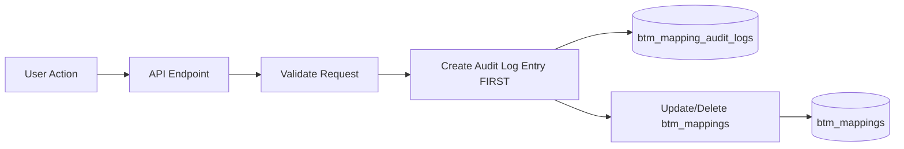
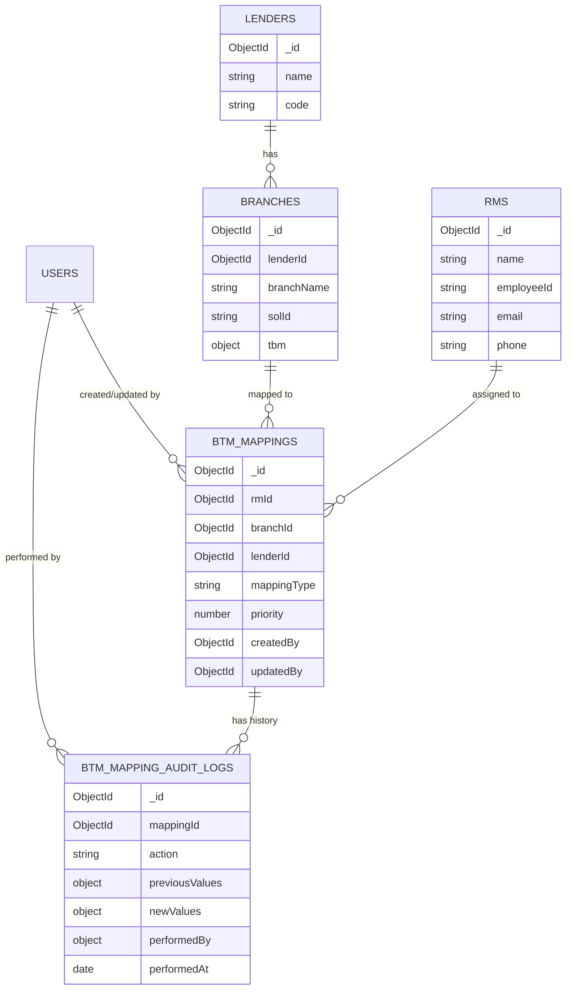
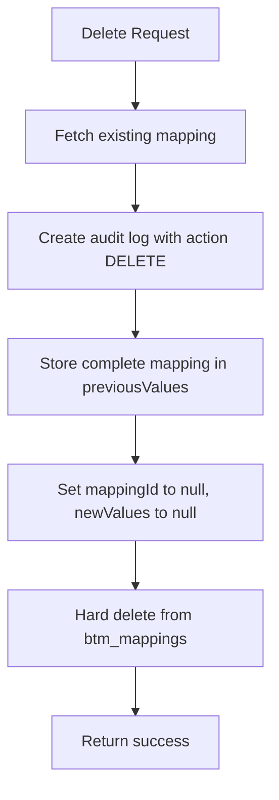

# BTM Mapping Database Design (Updated)

## Existing vs New Collections

| Collection | Status |

|------------|--------|

| `lenders` | Already exists - will reference |

| `branches` | Already exists - will reference |

| `rms` | New - to be created |

| `btm_mappings` | New - to be created |

| `btm_mapping_audit_logs` | New - for audit trail |

## Delete Strategy

**Hard Delete with Audit Log** - When a mapping is deleted:

1. Record full details in `btm_mapping_audit_logs` with `action: "DELETE"`
2. Permanently remove from `btm_mappings` collection
3. Audit log preserves complete history for compliance and recovery

---

## Data Flow with Auditing



---

## Collection Schemas

### 1. `rms` Collection (NEW)

Stores Relationship Manager information. No audit fields needed.

```javascript
{
  _id: ObjectId,
  name: String,                 // "Roshni"
  employeeId: String,           // "RM1234" (unique - from CSV)
  email: String,                // "roshni@example.com"
  phone: String,                // "9876543210"
  designation: String,          // "Senior Relationship Manager"
  city: String,                 // Primary city
  createdAt: Date,
  updatedAt: Date
}
```

**Indexes:**

- `{ employeeId: 1 }` (unique)
- `{ city: 1 }`

---

### 2. `btm_mappings` Collection (NEW)

Stores the mapping between RMs and Branches. Only contains **active mappings** (deleted records are removed and stored in audit log).

```javascript
{
  _id: ObjectId,
  rmId: ObjectId,               // Reference to rms collection
  branchId: ObjectId,           // Reference to existing branches collection
  lenderId: ObjectId,           // Reference to existing lenders collection
  
  mappingType: String,          // "Fed 1", "Fed 2", "SIB 1", "AXIS 1"
  priority: Number,             // 1 = Primary, 2 = Secondary
  
  // Audit fields - WHO made changes
  createdBy: ObjectId,          // User who created this mapping
  updatedBy: ObjectId,          // User who last updated this mapping
  createdAt: Date,
  updatedAt: Date
}
```

**Indexes:**

- `{ rmId: 1, branchId: 1 }` (unique - prevents duplicate mappings)
- `{ rmId: 1, lenderId: 1, priority: 1 }` (for RM view queries)
- `{ branchId: 1 }` (for Branch view queries)
- `{ updatedBy: 1, updatedAt: -1 }` (for audit queries)

---

### 3. `btm_mapping_audit_logs` Collection (NEW)

Comprehensive audit trail for all mapping changes. Stores **complete mapping object** before and after the action.

```javascript
{
  _id: ObjectId,
  
  // What was changed - IDs preserved for querying even after delete
  mappingId: ObjectId,          // Reference to btm_mappings (null after DELETE)
  rmId: ObjectId,               // Reference to rms (preserved for context)
  branchId: ObjectId,           // Reference to branches (preserved for context)
  lenderId: ObjectId,           // Reference to lenders (preserved for context)
  
  // What action was performed
  action: String,               // "CREATE", "UPDATE", "DELETE"
  
  // Complete mapping state BEFORE the action (null for CREATE)
  previousValues: {
    _id: ObjectId,
    rmId: ObjectId,
    branchId: ObjectId,
    lenderId: ObjectId,
    mappingType: String,
    priority: Number,
    createdBy: ObjectId,
    updatedBy: ObjectId,
    createdAt: Date,
    updatedAt: Date
  },
  
  // Complete mapping state AFTER the action (null for DELETE)
  newValues: {
    _id: ObjectId,
    rmId: ObjectId,
    branchId: ObjectId,
    lenderId: ObjectId,
    mappingType: String,
    priority: Number,
    createdBy: ObjectId,
    updatedBy: ObjectId,
    createdAt: Date,
    updatedAt: Date
  },
  
  // Who made the change
  performedBy: {
    userId: ObjectId,           // Reference to users collection
    userName: String,           // Denormalized for quick display
    userEmail: String,          // Denormalized for quick display
    userRole: String            // Role at time of action
  },
  
  // Optional notes
  remarks: String,
  
  // When
  performedAt: Date             // Timestamp of action
}
```

**Indexes:**

- `{ mappingId: 1, performedAt: -1 }` (history for a mapping)
- `{ "performedBy.userId": 1, performedAt: -1 }` (all actions by a user)
- `{ rmId: 1, performedAt: -1 }` (all changes for an RM)
- `{ branchId: 1, performedAt: -1 }` (all changes for a branch)
- `{ action: 1, performedAt: -1 }` (filter by action type)
- `{ performedAt: -1 }` (recent activity)

---

## Entity Relationships



---

## Audit Log Examples

### Example 1: New Mapping Created

```javascript
{
  _id: ObjectId("audit001"),
  mappingId: ObjectId("mapping123"),
  rmId: ObjectId("rm456"),
  branchId: ObjectId("branch789"),
  lenderId: ObjectId("lender001"),
  action: "CREATE",
  previousValues: null,           // Nothing before CREATE
  newValues: {                    // Complete new mapping
    _id: ObjectId("mapping123"),
    rmId: ObjectId("rm456"),
    branchId: ObjectId("branch789"),
    lenderId: ObjectId("lender001"),
    mappingType: "Fed 1",
    priority: 1,
    createdBy: ObjectId("user123"),
    updatedBy: ObjectId("user123"),
    createdAt: ISODate("2025-01-15T10:30:00Z"),
    updatedAt: ISODate("2025-01-15T10:30:00Z")
  },
  performedBy: {
    userId: ObjectId("user123"),
    userName: "Admin User",
    userEmail: "admin@company.com",
    userRole: "admin"
  },
  remarks: "Bulk upload from mapping_jan2025.csv",
  performedAt: ISODate("2025-01-15T10:30:00Z")
}
```

### Example 2: Mapping Updated

```javascript
{
  _id: ObjectId("audit002"),
  mappingId: ObjectId("mapping123"),
  rmId: ObjectId("rm456"),
  branchId: ObjectId("branch789"),
  lenderId: ObjectId("lender001"),
  action: "UPDATE",
  previousValues: {               // Complete mapping BEFORE update
    _id: ObjectId("mapping123"),
    rmId: ObjectId("rm456"),
    branchId: ObjectId("branch789"),
    lenderId: ObjectId("lender001"),
    mappingType: "Fed 1",
    priority: 1,
    createdBy: ObjectId("user123"),
    updatedBy: ObjectId("user123"),
    createdAt: ISODate("2025-01-15T10:30:00Z"),
    updatedAt: ISODate("2025-01-15T10:30:00Z")
  },
  newValues: {                    // Complete mapping AFTER update
    _id: ObjectId("mapping123"),
    rmId: ObjectId("rm456"),
    branchId: ObjectId("branch789"),
    lenderId: ObjectId("lender001"),
    mappingType: "Fed 2",
    priority: 2,
    createdBy: ObjectId("user123"),
    updatedBy: ObjectId("user789"),
    createdAt: ISODate("2025-01-15T10:30:00Z"),
    updatedAt: ISODate("2025-01-16T14:20:00Z")
  },
  performedBy: {
    userId: ObjectId("user789"),
    userName: "Manager Name",
    userEmail: "manager@company.com",
    userRole: "manager"
  },
  remarks: null,
  performedAt: ISODate("2025-01-16T14:20:00Z")
}
```

### Example 3: Mapping Deleted (Hard Delete)

```javascript
{
  _id: ObjectId("audit003"),
  mappingId: null,                // Mapping no longer exists
  rmId: ObjectId("rm456"),
  branchId: ObjectId("branch789"),
  lenderId: ObjectId("lender001"),
  action: "DELETE",
  previousValues: {               // Complete mapping BEFORE delete
    _id: ObjectId("mapping123"),
    rmId: ObjectId("rm456"),
    branchId: ObjectId("branch789"),
    lenderId: ObjectId("lender001"),
    mappingType: "Fed 2",
    priority: 2,
    createdBy: ObjectId("user123"),
    updatedBy: ObjectId("user789"),
    createdAt: ISODate("2025-01-15T10:30:00Z"),
    updatedAt: ISODate("2025-01-16T14:20:00Z")
  },
  newValues: null,                // Nothing after DELETE
  performedBy: {
    userId: ObjectId("user789"),
    userName: "Manager Name",
    userEmail: "manager@company.com",
    userRole: "manager"
  },
  remarks: "RM transferred to different region",
  performedAt: ISODate("2025-01-20T09:15:00Z")
}
```

---

## Delete Operation Flow



---

## Sample Audit Queries

### Get all changes for a specific RM (including deleted mappings)

```javascript
db.btm_mapping_audit_logs.find({
  rmId: ObjectId("rm456")
}).sort({ performedAt: -1 })
```

### Get all deleted mappings

```javascript
db.btm_mapping_audit_logs.find({
  action: "DELETE"
}).sort({ performedAt: -1 })
```

### Get all changes made by a specific user

```javascript
db.btm_mapping_audit_logs.find({
  "performedBy.userId": ObjectId("user123")
}).sort({ performedAt: -1 })
```

### Restore a deleted mapping (from audit log)

```javascript
// Find the DELETE audit log
const deleteLog = await AuditLog.findOne({
  rmId: ObjectId("rm456"),
  branchId: ObjectId("branch789"),
  action: "DELETE"
}).sort({ performedAt: -1 });

// Recreate the mapping from previousValues
const restoredMapping = await BTMMapping.create({
  rmId: deleteLog.previousValues.rmId,
  branchId: deleteLog.previousValues.branchId,
  lenderId: deleteLog.previousValues.lenderId,
  mappingType: deleteLog.previousValues.mappingType,
  priority: deleteLog.previousValues.priority,
  createdBy: currentUserId,
  updatedBy: currentUserId
});

// Log the restore action
await AuditLog.create({
  mappingId: restoredMapping._id,
  rmId: restoredMapping.rmId,
  branchId: restoredMapping.branchId,
  lenderId: restoredMapping.lenderId,
  action: "CREATE",
  previousValues: null,
  newValues: restoredMapping.toObject(),
  performedBy: { userId, userName, userEmail, userRole },
  remarks: "Restored from deleted mapping",
  performedAt: new Date()
});
```

---

## API Endpoints

| Method | Endpoint | Purpose |

|--------|----------|---------|

| POST | `/api/btm-mapping/get-upload-url` | Get S3 pre-signed URL |

| POST | `/api/btm-mapping/confirm-upload` | Process CSV and log bulk action |

| GET | `/api/btm-mapping/branches` | Get branch view data |

| GET | `/api/btm-mapping/rms` | Get RM view data |

| PUT | `/api/btm-mapping/:id` | Update mapping (creates audit log) |

| DELETE | `/api/btm-mapping/:id` | **Hard delete** mapping (creates audit log) |

| GET | `/api/btm-mapping/:id/history` | Get audit history for a mapping |

| GET | `/api/btm-mapping/audit-logs` | Get all audit logs with filters |

| POST | `/api/btm-mapping/restore/:auditLogId` | Restore a deleted mapping |

---

## Implementation Notes

1. **Hard Deletes**: Permanently remove from `btm_mappings`, preserve complete mapping in audit log
2. **Audit First**: Create audit log entry BEFORE deleting (ensures log exists even if delete fails)
3. **Complete Snapshots**: `previousValues` and `newValues` store the entire mapping object for full traceability
4. **Existing Collections**: Reference `lenders` and `branches` by their existing `_id` - lookup by `solId` for branches
5. **Restore Capability**: Can recreate deleted mappings from `previousValues` in audit log
6. **No RM Auditing**: RMs collection does not track who created/updated - only mappings are audited
